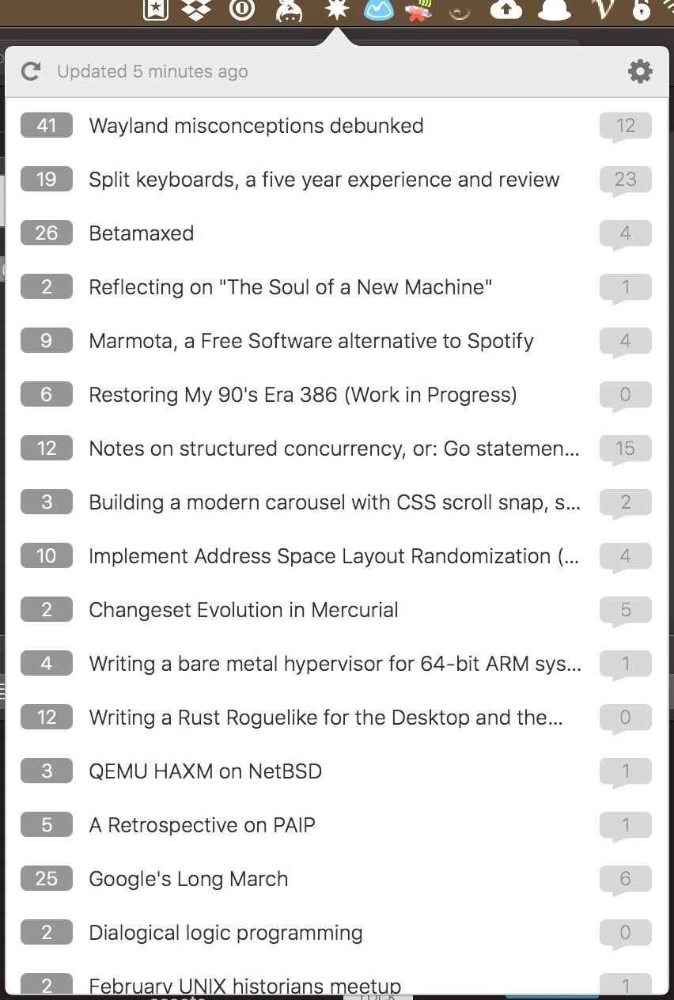

## Lobsters Bar

	

<a href="https://github.com/dwarvesf/lobsters-bar/releases/latest">
 		
	
	

## 🚀 Lobsters Bar
Displaying recent Lobste.rs posts in your MacOS menubar

## ⚙️ Install
From Source:

1. Clone this project
2. Install dependencies with `pod install`
3. Archive this project

From Image:

1. [Download](https://github.com/dwarvesf/lobsters-bar/releases/latest), open, and drag the app to the Applications folder.

## Usage
* Click to Lobsters Bar icon to show post from Lobste.rs 

## Requirements
macOS version >= 10.13 

